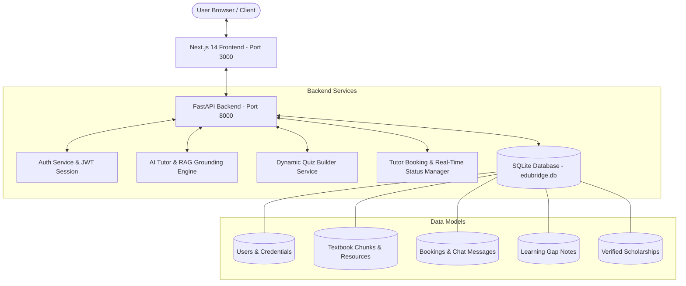

# 🎓 EduBridge AI — AWS AI Academic Platform

[](https://nextjs.org/)
[](https://reactjs.org/)
[](https://www.typescriptlang.org/)
[](https://fastapi.tiangolo.com/)
[](https://tailwindcss.com/)
[](https://www.sqlite.org/)

An end-to-end, production-grade **AI-powered academic platform** connecting personalized open-ended AI tutoring, Retrieval-Augmented Generation (RAG) textbook grounding, automated student struggle detection, 1-on-1 human tutor matching & session booking, dynamic 4-step practice quiz generation, visual progress tracking with learning gap notes, open educational resource management, and verified government scholarship access.

---

## 📑 Table of Contents

- [Features Overview](#-features-overview)
  - [Student Portal](#1-student-portal)
  - [Tutor Portal](#2-tutor-portal)
  - [Admin Control Panel](#3-admin-control-panel)
- [System Architecture](#-system-architecture)
- [Tech Stack](#-tech-stack)
- [Prerequisites](#-prerequisites)
- [Local Quickstart Guide](#-local-quickstart-guide)
  - [1. Backend Setup (FastAPI)](#1-backend-setup-fastapi)
  - [2. Frontend Setup (Next.js)](#2-frontend-setup-nextjs)
- [User Roles & Test Credentials](#-user-roles--test-credentials)
- [API Endpoints Reference](#-api-endpoints-reference)
- [Design System & Theme Directives](#-design-system--theme-directives)
- [License & Contributions](#-license--contributions)

---

## ✨ Features Overview

### 1. Student Portal
- **Subject Onboarding & Dashboard**: Clean initial state for new accounts with interactive course enrollment (DBMS, Calculus, Data Structures, Physics, etc.).
- **Open-Ended AI Tutor**: Solves complex academic queries with reference document grounding (`Grounded in Reference: [Title]`).
- **Automated Struggle Detection**: Detects repeated student confusion and prompts a 1-on-1 human tutor handoff modal.
- **Human Tutor Search & Booking**: Filter verified tutors by Subject, Concept, and Language. Book slots with real-time lock prevention.
- **Dynamic 4-Step Quiz Builder**: Select Subject $\rightarrow$ Concept $\rightarrow$ Difficulty $\rightarrow$ Generate custom quiz questions via AI.
- **Progress Tracking & Learning Gaps**: Interactive Add/Edit/Delete learning gap notes integrated with visual progress charts.
- **Verified Scholarships Portal**: Direct access to official government scholarship applications with external portal links.

### 2. Tutor Portal
- **Tutor Dashboard & Analytics**: Overview of assigned students, teaching metrics, and scheduled sessions.
- **Booking Requests Queue**: Real-time incoming session requests with functional **Accept** and **Reject** actions.
- **Availability Calendar Grid**: Toggle date slots as Available or Blocked with locked booked slot protection.
- **Student Learning Gap Notes**: Inspect assigned students' weak topics and append/delete pedagogical notes.

### 3. Admin Control Panel
- **Educational Resources Manager**: Ingest and delete open educational textbook chunks (`POST /resources`, `DELETE /resources/{id}`) for RAG AI retrieval.
- **User Account & Role Management**: Filter users by role (Student, Tutor, Admin), search by keyword, and revoke accounts with modal confirmation prompts (`DELETE /admin/users/{id}`).
- **Scholarship Source Verifier**: Sync and verify official government scholarship links and application deadlines.

---

## 🏗️ System Architecture



---

## 💻 Tech Stack

- **Frontend**: Next.js 14 (App Router), React 18, TypeScript, Tailwind CSS (Clean White Academic Theme), Lucide Icons, Recharts.
- **Backend**: FastAPI, Uvicorn Server, Python 3.9+, Pydantic schemas, SQLAlchemy ORM.
- **Database**: SQLite (`edubridge.db`).

---

## 📋 Prerequisites

Ensure you have the following installed on your local development machine:
1. **Python 3.9+**
2. **Node.js 18.x+** and **npm**

---

## 🚀 Local Quickstart Guide

### 1. Backend Setup (FastAPI)

```bash
# 1. Change directory to backend
cd backend

# 2. Install Python dependencies
pip install -r requirements.txt

# 3. Start the FastAPI development server
python -m uvicorn app.main:app --port 8000 --reload
```

- **Backend API Base**: `http://localhost:8000`
- **Swagger Documentation**: `http://localhost:8000/docs`

---

### 2. Frontend Setup (Next.js)

```bash
# 1. Open a new terminal in the project root
cd d:\EduBridge\edubridge-ai

# 2. Install Node packages
npm install

# 3. Start Next.js development server
npm run dev
```

- **Frontend Application URL**: `http://localhost:3000`

---

## 🔑 User Roles & Test Credentials

Navigate to `http://localhost:3000/login` to sign in under any of the 3 user roles:

| Role | Email Address | Default Password | Primary Dashboard Route |
| :--- | :--- | :--- | :--- |
| **Student** | `student@edubridge.ai` | *(any text / demo)* | `/student/dashboard` |
| **Tutor** | `tutor.rajesh@edubridge.ai` | *(any text / demo)* | `/teacher/dashboard` |
| **Admin** | `admin@edubridge.ai` | *(any text / demo)* | `/admin/dashboard` |

---

## 📡 API Endpoints Reference

| Method | Endpoint | Description |
| :--- | :--- | :--- |
| `POST` | `/auth/login` | Authenticate user & issue JWT token |
| `POST` | `/auth/register` | Register new Student or Tutor account |
| `POST` | `/ai/chat` | Send question to AI Tutor (supports document grounding & struggle detection) |
| `POST` | `/quizzes/generate` | Dynamically generate quiz questions by subject, concept & difficulty |
| `GET` | `/tutors` | Search and filter verified human tutors |
| `POST` | `/bookings` | Create pending booking session request |
| `PUT` | `/bookings/{id}` | Update session booking status (`accepted` or `rejected`) |
| `GET` | `/bookings/{id}/messages` | Retrieve session chat messages |
| `POST` | `/bookings/{id}/messages` | Send message in session chat |
| `GET` | `/progress/notes` | Fetch student learning gap notes |
| `POST` | `/progress/notes` | Add new learning gap note |
| `DELETE` | `/progress/notes/{id}` | Remove learning gap note |
| `POST` | `/resources` | Add new open educational resource chunk |
| `DELETE` | `/resources/{id}` | Remove educational resource |
| `GET` | `/admin/users` | List all platform users |
| `DELETE` | `/admin/users/{id}` | Remove user account from system |

---

## 🎨 Design System & Theme Directives

The entire platform follows a **Clean White Academic Theme**:
- **Background**: Slate 50 (`bg-slate-50`)
- **Card Elements**: Pure White (`#ffffff`) with subtle slate borders (`border-slate-200`) and soft shadows (`shadow-xs`).
- **Typography**: Dark Slate (`text-slate-900` headings, `text-slate-500` captions).
- **Accents**: Academic Royal Blue (`bg-blue-600`), Emerald Green for positive status (`bg-emerald-50 text-emerald-700`), Amber for pending alerts (`bg-amber-50 text-amber-700`).

---

## 📄 License & Contributions

Distributed under the **MIT License**. See `LICENSE` for more information. Built for AWS AI Academic Platform initiative.